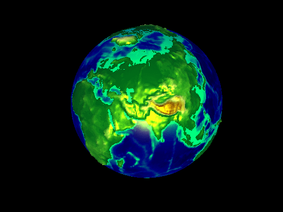

# sat-image

Yan Li got her Bachelor degree of engineering from Wuhan University of Hydraulic and Electric Engineering (Now Wuhan University) China, and Master and PhD degree of engineering from Huazhong University, China. 

Yan enjoys working with industrial professionals from all over the world, and loves working on R&D of software and tools for feature extraction and image processing. Since ten years ago, she has cooperated with one major transnational corporation of GIS, Pasco Japan, and made good achievements. The image segmentation software she developed has been embedded by the leading enterprise Google.

This is a site to display what Yan has developed on image processing and pattern recognition. If you are interested in these projects and products please feel free to contact her at +86 13913839671, or the emails in the bottom of this page.
<h3></h3>

<h3> -Image enhancement </h3>

<h3> -Image segmentation </h3>

<h3> -Atmospheric correction </h3>

<h3> -AOD retrieval </h3>

<h3> -Building extraction and modeling </h3>

<h3> -Road extraction and modeling </h3>

Support or Contact

lily-hust@163.com
lily.hust.essi@gmail.com
